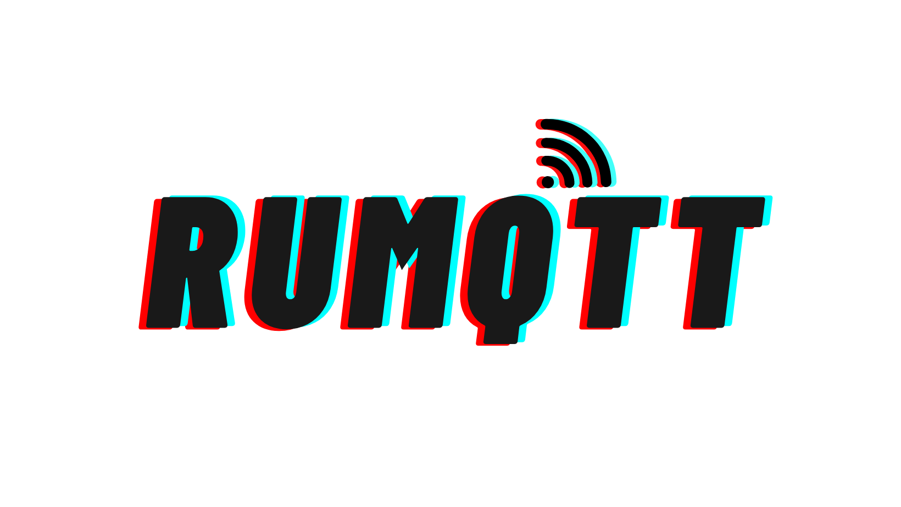

<div align="center">
    
</div>
<div align="center">
  <a href="https://github.com/bytebeamio/rumqtt/actions/workflows/build.yml">
    
  </a>
  <a href="https://discord.gg/mpkSqDg">
    
  </a>
</div>
<br/>

## What is rumqtt?

rumqtt is an opensource set of libraries written in rust-lang to implement the MQTT standard while striving to be simple, robust and performant.

| Crate | Description | version |
| -- | -- | -- |
| [rumqttc](./rumqttc/)| A high level, easy to use mqtt client | [](https://crates.io/crates/rumqttc) |
| [rumqttd](./rumqttd/) | A high performance, embeddable MQTT broker |[](https://crates.io/crates/rumqttd) |


# Contents

- [Installation and Usage](#installation-and-usage)
    - [rumqttd](#rumqttd)
        - [Compile from source](#compile-from-source)
        - [Install using cargo](#install-using-cargo)
        - [Run using Docker](#run-using-docker)
    - [rumqttc](#rumqttc)
- [Features](#features)
    - [rumqttd](#rumqttd)
    - [rumqttc](#rumqttc)
- [Contributing](#contributing)
- [License](#license)

> NOTE: MQTTv5 implementation of both client and broker are WIP, so currently only MQTTv311 is supported.

# Installation and Usage

## rumqttd

### Compile from source

Clone the repo using git clone.

```
git clone --depth=1 https://github.com/bytebeamio/rumqtt/
```

Change directory to that folder and run

```
cd rumqtt
cargo run --bin rumqttd -- -c rumqttd/demo.toml -vvv
```

### Install using cargo

```
cargo install --git https://github.com/bytebeamio/rumqtt rumqttd
```

and run using

```
rumqttd --config demo.toml
```

Note: Make sure to you correct demo.toml file for a specific version of rumqttd


### Run using docker

rumqttd can be used with docker by pulling the image from docker hub as follows:
```bash
docker pull bytebeamio/rumqttd
```

To use the rumqttd docker image with the included `demo.toml` while exposing the necessary ports for clients to interact with the broker, use the following command:
```bash
docker run -p 1883:1883 -p 1884:1884 -it bytebeamio/rumqttd -c demo.toml
```

One can also mount the local directory containing configs as a volume and use the appropriate config file as follows:
```bash
docker run -v /path/to/configs:/configs -p 1883:1883 -it bytebeamio/rumqttd -c /configs/config.toml
```

for more information look at rumqttd's [README](https://github.com/bytebeamio/rumqtt/blob/main/rumqttd/README.md)

## rumqttc

Add rumqttc to your project using

```
cargo add rumqttc --all-features
```

for more information look at rumqttc's [README](https://github.com/bytebeamio/rumqtt/blob/main/rumqttc/README.md)


# Features

## rumqttd

#### Currently supported features

- MQTT 3.1.1
- QoS 0 and 1
- Retained messages
- Connection via TLS
- Last will
- All MQTT 3.1.1 packets

#### Future scope

- QoS 2
- Retransmission after reconnect
- MQTT 5


## rumqttc

#### Currently supported features

- MQTT 3.1.1

### Future scope

- MQTT 5 client

# Contributing
Please follow the [code of conduct](docs/CoC.md) while opening issues to report bugs or before you contribute fixes, also do read our [contributor guide](CONTRIBUTING.md) to get a better idea of what we'd appreciate and what we won't.

# License

This project is released under The Apache License, Version 2.0 ([LICENSE](./LICENSE) or http://www.apache.org/licenses/LICENSE-2.0)

